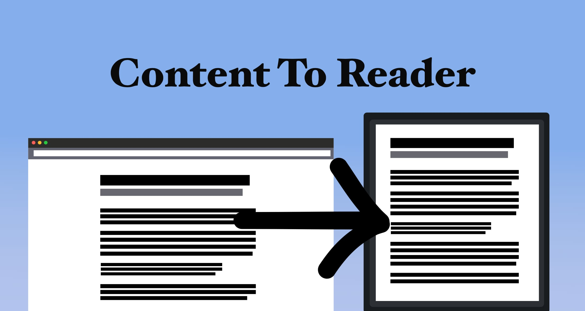
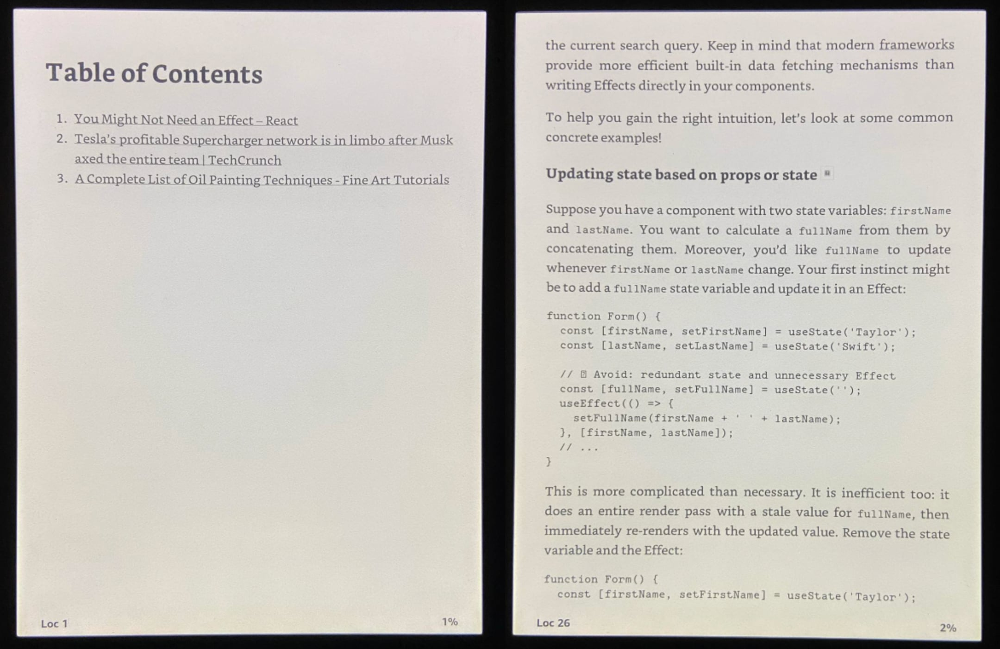

# content-to-reader

Extract meaningful content from any website and turn it into an EPUB file. Send it to your device using your Gmail account if you want.


# How to install and use

1. Install it globally using NPM (or any package manager)

```bash
npm i content-to-reader -g
```

2. Create a config file in a `.yaml` format

```yaml
# config.yaml
output: "./todays_news.epub"
toDevice:
  deviceEmail: your_kindle_A3BcD2@kindle.com
  senderEmail: your_email@gmail.com
  senderPassword: "your password"
pages:
  - https://clickbaitnews.com/article/some_article_12msad1
  - https://welldone.com/@user/10_easy_steps_to_whatever
```

3. Run this command to create an EPUB and/or send it to your Kindle

```bash
content-to-reader create -c ./config.yaml
```

4. Enjoy your articles


**If you run into any issues refer to [FAQ](#faq) section below.**

# Use cases

Here are a few use cases and ideas that you may use as a hint

### EPUB from a single URL

```bash
content-to-reader create https://welldone.com/@user/10_easy_steps_to_whatever
```

### I want to choose what to extract

Sometimes you want to pick elements from a target website yourself or maybe default extraction didn't work well for you. Use **selectors**.

```yaml
output: "./news.epub"
pages:
  - "https://clickbaitnews.com/article/some_article_12msad1"
  - url: "https://welldone.com/@user/10_easy_steps_to_whatever"
    selectors:
      - name: "Header"
        first: ".page-content header"
      - all:
          ".page-content .contents":
            [
              "h1",
              "h2",
              "h3",
              "h4",
              "h5",
              "p",
              "code",
              { ".custom-tip": ["p", "div", ".some-class": ["a", "p"]] },
            ]
      - first: ".page-content .comment-section"
```

Selectors let you pick elements from a target website using [CSS Selectors](https://www.w3schools.com/cssref/css_selectors.php). You can select `first` or `all` queried elements to be included in the final EPUB.

Final EPUB will contain all of the elements found by selectors.

You can generate longer CSS Selectors without repetition using YAML's dictionaries and arrays, for example:

```yaml
- all:
    ".page-content .contents": ["h1", "h2", "h3"]
```

equals

```yaml
- all: ".page-content .contents .h1, .page-content .contents .h2, .page-content .contents .h3"
```

You can nest dictionaries in arrays recursively.

### Send to Kindle

`content-to-reader` allows you to use services like Amazon's "Send To Kindle":

```yaml
toDevice:
  deviceEmail: your_kindle_A3BcD2@kindle.com
  senderEmail: your_email@gmail.com
  senderPassword: "your password"
pages:
  - https://welldone.com/@user/10_easy_steps_to_whatever
```

If you've never sent to Kindle using email before, there are a few steps to follow in order to make this work.

First, [whitelist your email address](https://www.amazon.com/gp/help/customer/display.html%3FnodeId%3DGX9XLEVV8G4DB28H) in Amazon then [create application password for your Gmail account](https://support.google.com/mail/answer/185833?hl=en) so you can use it in `.yaml` config file. And that should do it.

Currently only Gmail's SMTP server is supported.

# FAQ

<details>
  <summary>Amazon isn't accepting generated EPUB files</summary>
  You've got an email saying Amazon didn't accept your file. Now what?

Is your email address known by Amazon? If not then [whitelist your email address](https://www.amazon.com/gp/help/customer/display.html%3FnodeId%3DGX9XLEVV8G4DB28H) in Amazon.

Isn't your file too big? Remember that "Send to Kindle" imposes 50mb limit.

Sometimes Amazon just rejects a file for whatever reason. You can use Calibre as a last resort and let it do its magic so Amazon accepts your file. There's a ton of material on this on the Internet.

</details>
<details>
  <summary>Gmail isn't working</summary>
    You can't use your regular Gmail password. [Create application password for your Gmail account](https://support.google.com/mail/answer/185833?hl=en) so you can use it in `.yaml` config file.

</details>
<details>
  <summary>content-to-reader didn't extract content I wanted</summary>
  
  Default extraction algorithm isn't perfect. Sometimes it fails to extract the exact content you're interested in. You can use selectors to pick relevant elements yourself. Please see "I want to choose what to extract" in Use Cases.
</details>
<details>
  <summary>Images not rendered in generated EPUB</summary>
  If the website you're targeting requests resources (such as images) using unencrypted connection (`http` instead of `https`) then those resources will be ignored. Use HTTPS.

Currently there is no way to change this behaviour.

</details>

# License
Licensed under The Prosperity Public License 3.0.0.

<!--  -->

# Contributions

Any contributions are welcome. If you have an idea or you spotted a bug feel free to open an issue or a pull request.
